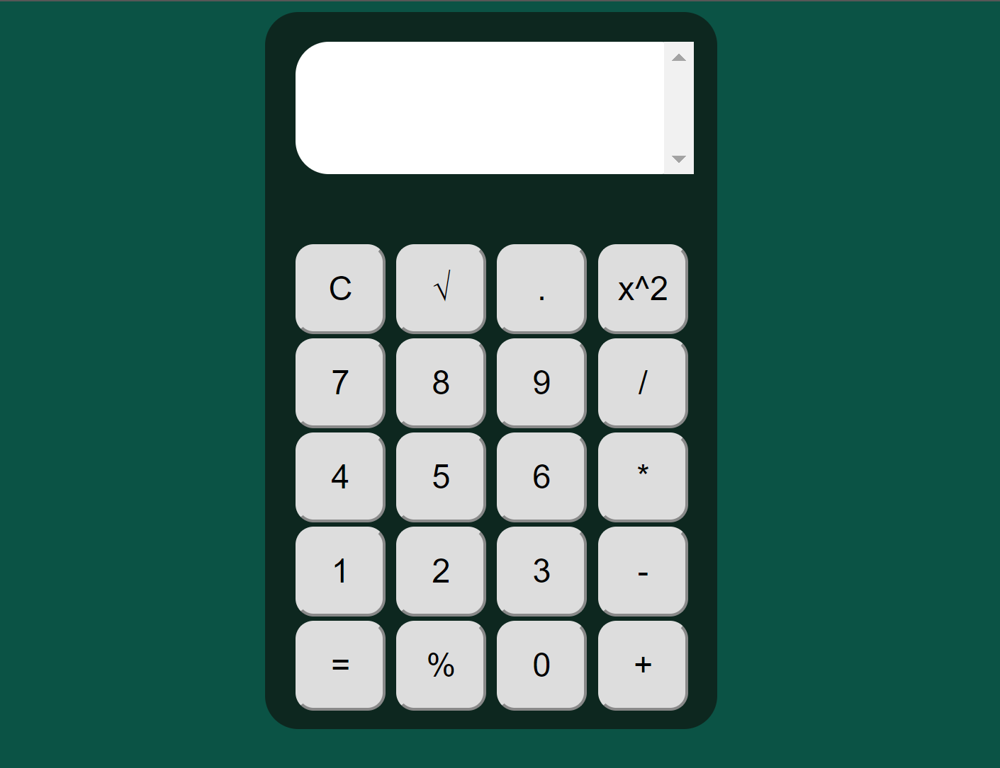

| Se pide construir una calculadora en el lenguaje de programación de JavaScript con base a un formulario HTML usando botones y una caja de texto. Además, para que permita realizar operaciones aritméticas de complejidad básica, como: suma, resta, multiplicación, división, raíz cuadrada, entre otros. A continuación, se muestra un ejemplo de las operaciones que debe realizar la calculadora. **Codigo HTML (Vista).** \<!DOCTYPE html\> \<html\> \<head\> \<meta charset="UTF-8"\> \<title\>Calculadora con JavaScript\</title\> \<link type="text/css" href="../styles/styles.css" rel="stylesheet"\> \</head\> \<body onload="init();"\> \<table class="calculadora"\> \<tr\> \<td colspan="4"\>\\</span\>\</td\> \</tr\> \<tr\> \<td\>\<button id="reset"\>C\</button\>\</td\> \<td\>\<button id="raiz"\>&\#8730\</button\>\</td\> \<td\>\<button id="punto"\>.\</button\>\</td\> \<td\>\<button id="elevado2"\>x\^2\</button\>\</td\> \</tr\> \<tr\> \<td\>\<button id="siete"\>7\</button\>\</td\> \<td\>\<button id="ocho"\>8\</button\>\</td\> \<td\>\<button id="nueve"\>9\</button\>\</td\> \<td\>\<button id="division"\>/\</button\>\</td\> \</tr\> \<tr\> \<td\>\<button id="cuatro"\>4\</button\>\</td\> \<td\>\<button id="cinco"\>5\</button\>\</td\> \<td\>\<button id="seis"\>6\</button\>\</td\> \<td\>\<button id="multiplicacion"\>\*\</button\>\</td\> \</tr\> \<tr\> \<td\>\<button id="uno"\>1\</button\>\</td\> \<td\>\<button id="dos"\>2\</button\>\</td\> \<td\>\<button id="tres"\>3\</button\>\</td\> \<td\>\<button id="resta"\>-\</button\>\</td\> \</tr\> \<tr\> \<td\>\<button id="igual"\>=\</button\>\</td\> \<td\>\<button id="porcentaje"\>%\</button\>\</td\> \<td\>\<button id="cero"\>0\</button\>\</td\> \<td\>\<button id="suma"\>+\</button\>\</td\> \</tr\> \</table\> \<script src="../js/funciones.js"\>\</script\> \</body\> \</html\> **Codigo JavaScript (Funciones).** var operandoa; var operandob; var operacion; function init() { //variables var resultado = document.getElementById('resultado'); var reset = document.getElementById('reset'); var suma = document.getElementById('suma'); var resta = document.getElementById('resta'); var multiplicacion = document.getElementById('multiplicacion'); var division = document.getElementById('division'); var igual = document.getElementById('igual'); var uno = document.getElementById('uno'); var dos = document.getElementById('dos'); var tres = document.getElementById('tres'); var cuatro = document.getElementById('cuatro'); var cinco = document.getElementById('cinco'); var seis = document.getElementById('seis'); var siete = document.getElementById('siete'); var ocho = document.getElementById('ocho'); var nueve = document.getElementById('nueve'); var cero = document.getElementById('cero'); } punto.onclick = function (e) { resultado.textContent = resultado.textContent + "."; } uno.onclick = function (e) { resultado.textContent = resultado.textContent + "1"; } dos.onclick = function (e) { resultado.textContent = resultado.textContent + "2"; } tres.onclick = function (e) { resultado.textContent = resultado.textContent + "3"; } cuatro.onclick = function (e) { resultado.textContent = resultado.textContent + "4"; } cinco.onclick = function (e) { resultado.textContent = resultado.textContent + "5"; } seis.onclick = function (e) { resultado.textContent = resultado.textContent + "6"; } siete.onclick = function (e) { resultado.textContent = resultado.textContent + "7"; } ocho.onclick = function (e) { resultado.textContent = resultado.textContent + "8"; } nueve.onclick = function (e) { resultado.textContent = resultado.textContent + "9"; } cero.onclick = function (e) { resultado.textContent = resultado.textContent + "0"; } reset.onclick = function (e) { resetear(); } suma.onclick = function (e) { operandoa = resultado.textContent; operacion = "+"; limpiar(); } resta.onclick = function (e) { operandoa = resultado.textContent; operacion = "-"; limpiar(); } multiplicacion.onclick = function (e) { operandoa = resultado.textContent; operacion = "\*"; limpiar(); } raiz.onclick = function (e) { operandoa = resultado.textContent; operacion = "sqrt"; limpiar(); } elevado2.onclick = function (e) { operandoa=0; operandoa = resultado.textContent; res = Math.pow(parseFloat(operandoa),2); resetear(); resultado.textContent = res; } porcentaje.onclick = function (e) { operandoa = resultado.textContent; res = Math.floor(operandoa)/100; resultado.textContent = res; operandoa=res; } division.onclick = function (e) { operandoa = resultado.textContent; operacion = "/"; limpiar(); } igual.onclick = function (e) { operandob = resultado.textContent; resolver(); } function limpiar() { resultado.textContent = ""; } function resetear() { resultado.textContent = ""; operandoa = 0; operandob = 0; operacion = ""; } function resolver() { var res = 0; switch (operacion) { case "+": res = parseFloat(operandoa) + parseFloat(operandob); break; case "-": res = parseFloat(operandoa) - parseFloat(operandob); break; case "\*": res = parseFloat(operandoa) \* parseFloat(operandob); break; case "/": res = parseFloat(operandoa) / parseFloat(operandob); break; case "sqrt": res = Math.sqrt(parseFloat(operandoa)); break; // case "pow": // res = Math.pow(parseFloat(operandoa),2); // break; } resetear(); resultado.textContent = res; } |
|-----------------------------------------------------------------------------------------------------------------------------------------------------------------------------------------------------------------------------------------------------------------------------------------------------------------------------------------------------------------------------------------------------------------------------------------------------------------------------------------------------------------------------------------------------------------------------------------------------------------------------------------------------------------------------------------------------------------------------------------------------------------------------------------------------------------------------------------------------------------------------------------------------------------------------------------------------------------------------------------------------------------------------------------------------------------------------------------------------------------------------------------------------------------------------------------------------------------------------------------------------------------------------------------------------------------------------------------------------------------------------------------------------------------------------------------------------------------------------------------------------------------------------------------------------------------------------------------------------------------------------------------------------------------------------------------------------------------------------------------------------------------------------------------------------------------------------------------------------------------------------------------------------------------------------------------------------------------------------------------------------------------------------------------------------------------------------------------------------------------------------------------------------------------------------------------------------------------------------------------------------------------------------------------------------------------------------------------------------------------------------------------------------------------------------------------------------------------------------------------------------------------------------------------------------------------------------------------------------------------------------------------------------------------------------------------------------------------------------------------------------------------------------------------------------------------------------------------------------------------------------------------------------------------------------------------------------------------------------------------------------------------------------------------------------------------------------------------------------------------------------------------------------------------------------------------------------------------------------------------------------------------------------------------------------------------------------------------------------------------------------------------------------------------------------------------------------------------------------------------------------------------------------------------------------------------------------------------------------------------------------------------------------------------------------------------------------------------------------------------------------------------------------------------------------------------------------------------------------------------------------------------------------------------------------------------------------------------------------------------------------------------------------------------------------------------------------------------------------------------------------------------------------------------------------------------------------------------------------------------------------------------------------------------------------------------------------------------------------------------------------------------------------------------------------------------------------------------------------------------------------------------------------------------------------------------------------------------------------------------------------------------------------------------------------------------------------------------------------------------------------------------------------------------------------------------------------------------------------------------------------------------------------------------------------------------------------------------------------------------------------------------------------------------------------------------------------------------------------------------------------------------------------------------------------------------------------------------------------------------------------------------------------------------------------------------------------------------------------------------------------------------------------------------------------------------------------------------------------------------------------------|

| Diseñar una interfaz en HTML que permita ingresar los siguientes campos en un formulario: cedula, nombres, apellidos, dirección, teléfono, fecha de nacimiento y correo electrónico. Luego, usando funciones de JavaScript se debe validar que todos los campos han sido ingresados, además; que los valores ingresados en cada campo del formulario sean correctos teniendo en cuenta las siguientes condiciones: **Codigo HTML (Vista).** \<!DOCTYPE html\> \<html lang="es"\> \<head\> \<meta charset="UTF-8"\> \<meta name="viewport" content="width=device-width, initial-scale=1.0"\> \<meta http-equiv="X-UA-Compatible" content="ie=edge"\> \<script type="text/javascript" src="../js/validacion.js"\>\</script\> \<link rel="stylesheet" href="../styles/stylesF.css"\> \<title\>Document\</title\> \</head\> \<body\> \<form id="formulario01" action="../php/registrar.php" method="POST" onsubmit="return validarCamposObligatorios()"\> \<br\> \<br\> \<label for="cedula"\>Cedula (\*)\</label\> \<input type="text" id="cedula" name="cedula" value="" maxlength="10" placeholder="Ingrese el número de cedula ..." onkeypress="ValidarNumeros(event,'mensajeCedula',this)" /\> \<br\> \\</span\> \<br\> \<br\> \<label for="nombres"\>Nombres (\*)\</label\> \<input type="text" id="nombres" name="nombres" value="" placeholder="Ingrese sus dos nombres ..." onkeypress="ValidarLetras(event,'mensajeNombres',this)" /\> \<br\> \\</span\> \<br\> \<br\> \<label for="apellidos"\>Apelidos (\*)\</label\> \<input type="text" id="apellidos" name="apellidos" value="" placeholder="Ingrese sus dos apellidos ..." onkeypress="ValidarLetras(event,'mensajeApellidos',this)" /\> \<br\> \\</span\> \<br\> \<br\> \<label for="direccion"\>Dirección (\*)\</label\> \<input type="text" id="direccion" name="direccion" value="" placeholder="Ingrese su dirección ..." /\> \<br\> \\</span\> \<br\> \<br\> \<label for="telefono"\>Teléfono (\*)\</label\> \<input type="text" id="telefono" name="telefono" value="" placeholder="Ingrese su número telefónico ..." onkeypress="ValidarTelefono(event,'mensajeTelefono',this)" /\> \<br\> \\</span\> \<br\> \<br\> \<label for="fecha"\>Fecha Nacimiento (\*)\</label\> \<input type="text" id="fechaNacimiento" name="fechaNacimiento" value="" placeholder="Ingrese su fecha de nacimiento ..." onkeypress="validarFecha(event, 'mensajeFecha',this)" /\> \<br\> \\</span\> \<br\> \<br\> \<label for="correo"\>Correo electrónico (\*)\</label\> \<input type="text" id="correo" name="correo" value="" placeholder="Ingrese su correo electrónico ..." onkeypress="ValidarCorreo(event,'mensajeCorreo',this)" /\> \<br\> \\</span\> \<br\> \<br\> \
 \<input type="submit" class="ingresar" id="crear" name="crear" value="Aceptar" /\> \</div\> \</form\> \</body\> \</html\> |   |
|--------------------------------------------------------------------------------------------------------------------------------------------------------------------------------------------------------------------------------------------------------------------------------------------------------------------------------------------------------------------------------------------------------------------------------------------------------------------------------------------------------------------------------------------------------------------------------------------------------------------------------------------------------------------------------------------------------------------------------------------------------------------------------------------------------------------------------------------------------------------------------------------------------------------------------------------------------------------------------------------------------------------------------------------------------------------------------------------------------------------------------------------------------------------------------------------------------------------------------------------------------------------------------------------------------------------------------------------------------------------------------------------------------------------------------------------------------------------------------------------------------------------------------------------------------------------------------------------------------------------------------------------------------------------------------------------------------------------------------------------------------------------------------------------------------------------------------------------------------------------------------------------------------------------------------------------------------------------------------------------------------------------------------------------------------------------------------------------------------------------------------------------------------------------------------------------------------------------------------------------------------------------------------------------------------------------------------------------------------------------------------------------------------------------------------------------------------------------------------------------------------------------------------------------------------------------------------------------------------------------------------------------------------------------------------------------------------------------------------------------------------------------------------------------------------------------------------------------------------------------------------------------------------------------------------------------------------------------------------------------------------------------------------------------------------------------------------------|---|
| Diseñar una interfaz en html que tenga tres botones que diga “Anterior”, “Iniciar”, “Siguiente”, y una imagen. Luego, desde javascript se debe controlar para al hacer clic sobre uno de los botones realice una acción relacionada a una galería de imágenes (ver ejemplo, <https://gihp4c.blog.ups.edu.ec/>) **Codigo HTML (Vista).** \<!DOCTYPE html\> \<html lang="es"\> \<head\> \<meta charset="UTF-8"\> \<meta name="viewport" content="width=device-width, initial-scale=1.0"\> \<meta http-equiv="X-UA-Compatible" content="ie=edge"\> \<link rel="stylesheet" href="../styles/stylesT.css"\> \<script src="../js/transicion.js"\>\</script\> \<title\>Document\</title\> \</head\> \<body\> \<br\> \<br\> \<h1\>TRANSICION DE IMAGENES\</h1\> \<br\> \
 \
 \ \</div\> \<br\> \
 \<input type="submit" class="anterior" id="anterior" name="anterior" value="Anterior" onclick="anterior()" /\> \<input type="submit" class="iniciar" id="iniciar" name="iniciar" value="Iniciar" onclick="iniciar()" /\> \<input type="submit" class="siguiente" id="siguiente" name="siguiente" value="Siguiente" onclick="siguiente()" /\> \</div\> \</div\> \</body\> \</html\>                                                                                                                                                                                                                                                                                                                                                                                                                                                                                                                                                                                                                                                                                                                                                                                                                                                                                                                                                                                                                                                                                                                                                                                                                                                                                                                                                                                                                                                                                                                                                                                                                                                                                                                                                                   |   |

1.  Se debe validar qué, en el campo de la cedula, se ingrese sólo número y que
    la misma sea correcta, en base, al último dígito verificador.

**Codigo JavaScript (Funciones).**

function ValidarNumeros(event, label, elemento) {

let span = document.getElementById(label);

let numero = event.which \|\| event.keyCode;

if (numero \>= 48 && numero \<= 57) {

span.style.display = "none";

} else {

span.innerHTML = "Ingrese Numeros"

span.style.color = "red"

span.style.display = "block"

let cantidad = elemento.value;

cantidad = cantidad.substring(0, cantidad.length - 1)

elemento.value = cantidad

}

if (elemento.value.length === 10) {

validar(label, elemento);

}

}

function validar(label, elemento) {

cedula = elemento.value;

let span = document.getElementById(label);

var cad = cedula.trim();

var total = 0;

var longitud = cad.length;

var longcheck = longitud - 1;

if (cad !== "" && longitud === 10) {

for (i = 0; i \< longcheck; i++) {

if (i % 2 === 0) {

var aux = cad.charAt(i) \* 2;

if (aux \> 9) aux -= 9;

total += aux;

} else {

total += parseInt(cad.charAt(i));

}

}

total = total % 10 ? 10 - total % 10 : 0;

if (cad.charAt(longitud - 1) == total) {

span.innerHTML = "Cedula Válida";

span.style.display = "block"

span.style.color = "green"

} else {

span.innerHTML = "Cedula Inválida";

span.style.display = "block"

span.style.color = "red"

}

}

}

1.  Se debe validar qué, en el campo de los nombres, ingrese únicamente dos
    nombres y que permita ingresar sólo letras.

2.  Se debe validar qué, en el campo de los apellidos, ingrese únicamente dos
    apellidos y que permita ingresar sólo letras.

**Codigos JavaScript (Validacion).**

function ValidarLetras(event, label, elemento) {

let span = document.getElementById(label);

let letra = event.which \|\| event.keyCode;

if (letra \>= 65 && letra \<= 90 \|\| letra \>= 97 && letra \<= 122 \|\| letra
== 32 \|\| letra == 8 \|\| letra == 16) {

span.style.display = "none";

} else {

span.innerHTML = "Ingrese Letras"

span.style.display = "block"

span.style.color = "red"

let frase = elemento.value;

frase = frase.substring(0, frase.length - 1)

elemento.value = frase

}

let wordCount = elemento.value.trim().replace(/\\s+/gi, ' ').split(' ').length;

if (wordCount \> 2) {

span.innerHTML = "Ingrese solo dos nombres"

span.style.display = "block"

span.style.color = "red"

let frase = elemento.value;

frase = frase.substring(0, frase.length - 2)

elemento.value = frase

}

}

1.  Se debe validar qué, en el campo del teléfono, permita ingresar sólo
    números.

function ValidarTelefono(event, label, elemento) {

let span = document.getElementById(label);

let numero = event.which \|\| event.keyCode;

if (numero \>= 48 && numero \<= 57) {

span.style.display = "none";

} else {

span.innerHTML = "Ingrese Numeros"

span.style.display = "block"

span.style.color = "red"

let cantidad = elemento.value;

cantidad = cantidad.substring(0, cantidad.length - 1)

elemento.value = cantidad

}

if (elemento.value.length \>= 10) {

validar(label, elemento);

span.innerHTML = "Solo ingrese diez numeros"

span.style.display = "block"

span.style.color = "red"

let cantidad = elemento.value;

cantidad = cantidad.substring(0, cantidad.length - 1)

elemento.value = cantidad

}

}

1.  Se debe validar que la fecha de nacimiento ingrese en el formato dd/mm/yyyy.

function validarFecha(event, label, element) {

let span = document.getElementById(label);

let caracter = event.which \|\| event.keyCode;

let elemento = element.value

if (validarFormatoFecha(element)) {

if (fechaExistente(elemento)) {

span.innerHTML = "Fecha Valida"

span.style.display = "block"

span.style.color = "green"

} else {

span.innerHTML = "Fecha Invalida"

span.style.display = "block"

span.style.color = "red"

}

} else {

span.innerHTML = "Formato Invalido"

span.style.display = "block"

span.style.color = "red";

}

if (elemento.length \>= 11) {

span.innerHTML = "Fecha fuera de rango"

span.style.display = "block"

span.style.color = "red"

let cantidad = element.value;

cantidad = cantidad.substring(0, cantidad.length - 1)

element.value = cantidad

}

}

function validarFormatoFecha(element) {

let elemento = element.value

var formato = /\^\\d{1,2}\\/\\d{1,2}\\/\\d{2,4}\$/;

if ((elemento.match(formato)) && (elemento != '')) {

return true;

} else {

return false;

}

}

function fechaExistente(fecha) {

var fechaf = fecha.split("/");

var day = fechaf[0];

var month = fechaf[1];

var year = fechaf[2];

var date = new Date(year, month, '0');

if ((day - 0) \> (date.getDate() - 0)) {

return false;

}

return true;

}

1.  Se debe validar qué, en el campo correo electrónico, permita ingresar un
    correo válido. Se considera un correo válido, cuando comienza por tres o más
    valores alfanuméricos, luego un \@, seguido por la extensión “ups.edu.ec” o
    “est.ups.edu.ec”.

function ValidarCorreo(event, label, elemento) {

let span = document.getElementById(label);

let caracter = event.which \|\| event.keyCode;

let correo = elemento.value;

let email = /\^\\w+([\\.-]?\\w+)\*\@\\w+([\\.-]?\\w+)\*(\\.\\w{2,4})+\$/;

span.innerHTML = ""

span.style.display = "block"

if (!email.test(correo)) {

span.innerHTML = "Correo Invalido"

span.style.display = "block"

span.style.color = "red"

} else if (!email.test(correo)) {

span.innerHTML = "Correo Invalido"

span.style.display = "block"

span.style.color = "red"

} else {

span.innerHTML = "Correo Valido"

span.style.display = "block"

span.style.color = "green"

}

}

**Funciones JavaScript (Validacion).**

imagen1 = '\'

imagen2 = '\'

imagen3 = '\'

imagen4 = '\'

imagen5 = '\'

imagen6 = '\'

imagen7 = '\'

imagen8 = '\'

imagen9 = '\'

imagen10 = '\'

var fotos = [imagen1, imagen2, imagen3, imagen4, imagen5, imagen6, imagen7,
imagen8, imagen9, imagen10];

var aleatorios = new Array(5);

var numeroImagen = 0;

function iniciar() {

numeroImagen = 0;

aleatoriosR(fotos)

console.log(aleatorios)

document.getElementById('anterior').disabled = true;

document.getElementById('imagen').innerHTML = aleatorios[numeroImagen];

}

function siguiente() {

numeroImagen = numeroImagen + 1;

console.log(numeroImagen)

if (numeroImagen == 4) {

document.getElementById('siguiente').disabled = true;

} else {

if(numeroImagen\>0){

document.getElementById('anterior').disabled = false;

}

document.getElementById('siguiente').disabled = false;

}

document.getElementById('imagen').innerHTML = aleatorios[numeroImagen];

}

function anterior() {

if (numeroImagen === 0) {

document.getElementById('anterior').disabled = true;

} else {

if(numeroImagen\<4){

document.getElementById('siguiente').disabled = false;

}

document.getElementById('anterior').disabled = false;

}

console.log(numeroImagen)

document.getElementById('imagen').innerHTML = aleatorios[numeroImagen];

numeroImagen = numeroImagen - 1;

}

function aleatoriosR(elementos) {

var numaletorios=numerosAleatorios(elementos)

console.log(numaletorios[0])

console.log(numaletorios[1])

console.log(numaletorios[2])

console.log(numaletorios[3])

console.log(numaletorios[4])

for (var i = 0; i \< 5; i++){

aleatorios[i]=fotos[numaletorios[i]]

}

}

function numerosAleatorios() {

var cantidadNumeros = 5;

var myArray = []

while(myArray.length \< cantidadNumeros ){

var numeroAleatorio = Math.ceil(Math.random()\*9);

var existe = false;

for(var i=0;i\<myArray.length;i++){

if(myArray [i] == numeroAleatorio){

existe = true;

break;

}

}

if(!existe){

myArray[myArray.length] = numeroAleatorio;

}

}

return myArray;

}
